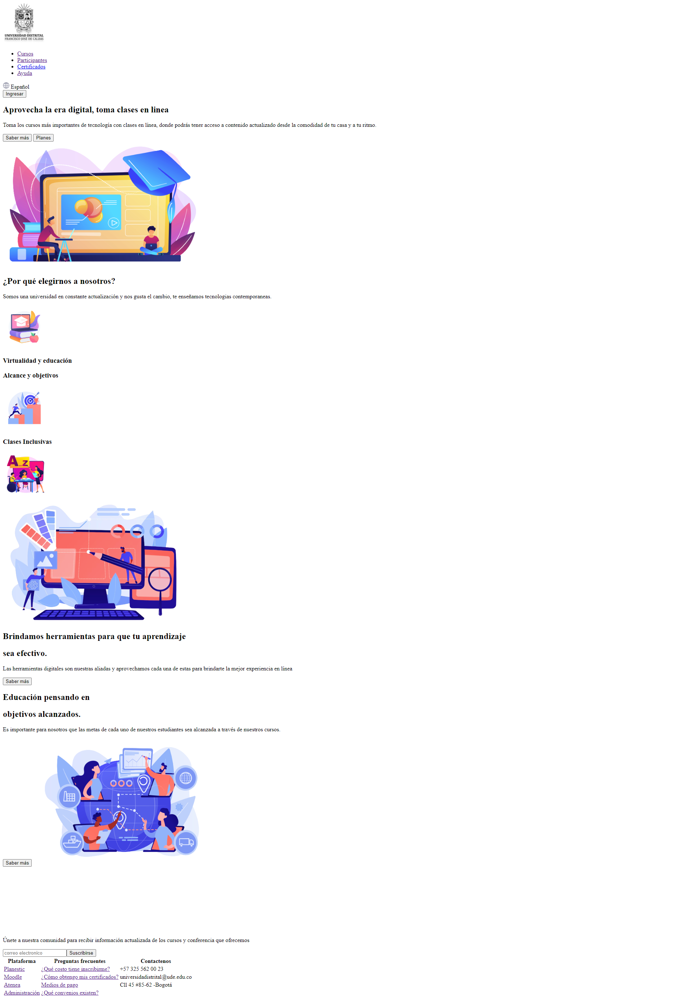

<h1>Taller 9: Sule Suarez </h1>

<h2>Información</h2>

Curso Full Stack Basico -Grupo 1

 Profesor: Cristian Patiño 

<h2> Punto 1: Link de Figma </h2>

<a href= "https://www.figma.com/file/sBwMHT3RlLkUOtrBcUROig/Sule-Figma?type=design&node-id=0%3A1&t=8lcF0Ofq0hKGfmA1-1" target="_blank"> Link de FIGMA</a>

<h2>Punto 2 HTML </h2>

<h2>Punto 3 HTML </h2>
